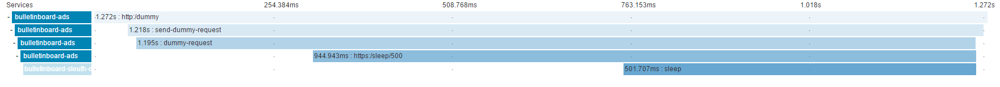

# Logging and Tracing
## Logging Library
Spring Boot already pre-configures various logging frameworks and provides a logging infrastructure.
As this builds on top of Logback, the SAP logging library can easily be integrated.
For this, we just need to add the corresponding dependencies (see `pom.xml`) and re-configure logback (`src/main/resources/logback.xml`).

## Distributed Tracing: Sleuth and Zipkin
Similar to the idea of the Correlation ID as used in the logging library and demonstrated in the course, the tools Sleuth and Zipkin try to solve similar issues. Sleuth can be used to (automatically) create, re-use and forward information useful for correlation, while Zipkin is a UI combining the snippets for analysis.

Instead of a single Correlation ID, Sleuth uses "traces" and "spans". A trace roughly corresponds to the Correlation ID as used in the logging library, i.e. it is used for "everything" happening from the first incoming request, through all downstream services, until the response of the initial request is served. In addition, attached to a trace, individual spans are created. These give more detailled information, e.g. about a single Hystrix command execution, or the time spent in a MVC REST endpoint method. By computing the timing differences between spans, it is possible to calculate the network delay. Additional information (i.e. descriptions) can also be attached to spans.

Zipkin automatically combines individual trace/span information, and shows it in a UI. In addition to the provided information, the timing details are shown graphically:

Sleuth automatically...
 - ...enhances `RestTemplate` beans (i.e. not created using `new`) to forward trace information (opening a new span)
 - ...intercepts incoming requests when using Spring MVC (parsing headers)
 - ...integrates with Spring MVC to add endpoint (method) information to the trace
 
When using Hystrix, existing spans are automatically continued, but one should manually create new span instead (see this [issue](https://github.com/spring-cloud/spring-cloud-sleuth/issues/405)).

To use Sleuth (sending the data using RabbitMQ), the following dependencies need to be added to `pom.xml`:
 - spring-cloud-starter-sleuth
 - spring-cloud-sleuth-stream
 - spring-cloud-stream-binder-rabbit

Furthermore, as only 10% of all traces are forwarded to Zipkin by default, for demonstration purposes this should be reconfigured.
This can be done by providing a corresponding `Sampler` bean, as shown in [SleuthConfiguration.java](../src/main/java/com/sap/bulletinboard/ads/config/SleuthConfiguration.java).

## Demonstration
There is a [dummy service](https://github.wdf.sap.corp/cc-java-dev/bulletinboard-sleuth-dummy) that just sleeps for N milliseconds,  using Eureka and Spring Cloud Config.
This server also uses Sleuth and is used as a downstream service for the `/sleuth` endpoint.

To visualize this, this sample [Zipkin server](https://github.wdf.sap.corp/cc-java-dev/cc-zipkin-server) can be used.
This server is configured to receive messages via RabbitMQ and deploy the Zipkin UI.
For demonstration purposes, the data is just "persisted" in memory.
 
## Further Material
- [Documentation](http://cloud.spring.io/spring-cloud-sleuth/spring-cloud-sleuth.html)
- [Good video](https://www.youtube.com/watch?v=eQV71Mw1u1c)
